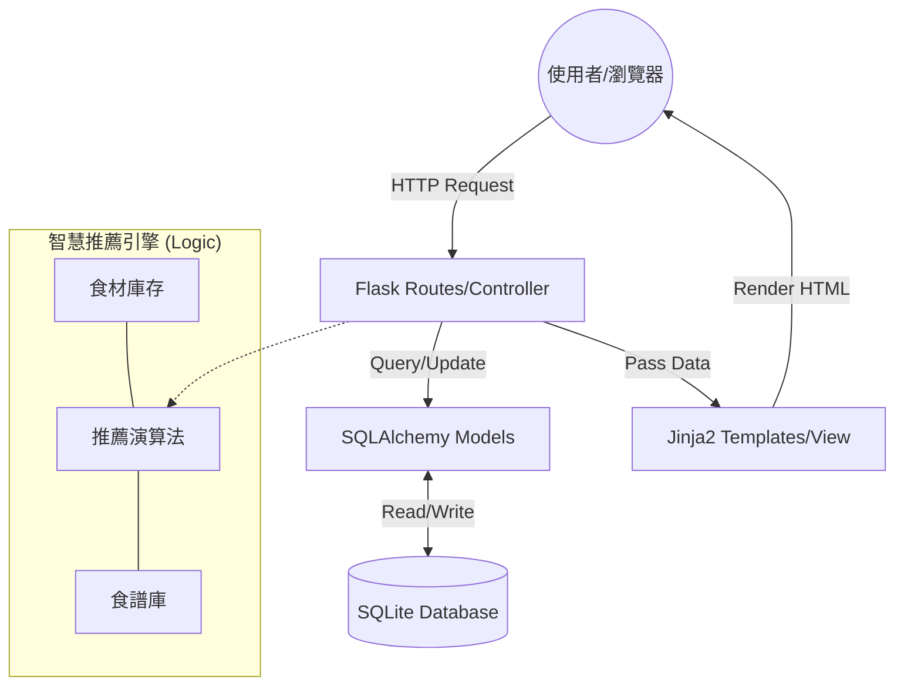

# 智慧烹飪菜單系統 - 系統架構文件 (Architecture)

## 1. 技術架構說明

本專案採用經典的 **MVC (Model-View-Controller)** 模式進行開發，確保程式碼結構清晰且易於維護。

### 選用技術與原因
- **後端框架：Flask (Python)**
  - 原因：輕量級、彈性大，適合中小型專案快速開發，且 Python 有強大的資料處理能力。
- **模板引擎：Jinja2**
  - 原因：Flask 內建，能夠將後端資料動態渲染進 HTML，達成伺服器端渲染 (SSR)。
- **資料庫：SQLite (SQLAlchemy)**
  - 原因：無需額外架設資料庫伺服器，資料儲存於單一檔案，方便開發與攜帶。
- **前端：Vanilla CSS**
  - 原因：保持最純粹的控制力，打造符合 PRD 要求的精美現代感 UI。

### MVC 模式說明
- **Model (資料模型)**：負責定義資料庫結構（如：食譜、食材、菜單計畫），處理資料的存取與邏輯。
- **View (視圖)**：由 Jinja2 模板組成的 HTML 頁面，負責將資料視覺化呈現給使用者。
- **Controller (控制器/路由)**：Flask 的路由函式，負責接收使用者請求、調度 Model 處理資料，最後回傳 View 給瀏覽器。

---

## 2. 專案資料夾結構

```text
smart-cooking-system/
├── app/
│   ├── __init__.py          # 初始化 Flask App 與資料庫連線
│   ├── models/              # 資料庫模型 (Models)
│   │   ├── user.py          # 使用者帳號資料
│   │   ├── recipe.py        # 食譜與步驟資料
│   │   ├── pantry.py        # 食材庫存資料
│   │   └── menu.py          # 菜單規劃資料
│   ├── routes/              # 路由處理 (Controllers)
│   │   ├── main.py          # 首頁與一般路由
│   │   ├── recipes.py       # 食譜管理路由
│   │   ├── menu.py          # 菜單規劃路由
│   │   └── api.py           # 處理食材推薦的輕量 API
│   ├── templates/           # Jinja2 模板 (Views)
│   │   ├── base.html        # 共用佈局 (Layout)
│   │   ├── index.html       # 首頁
│   │   ├── recipes/         # 食譜相關頁面
│   │   └── menu/            # 菜單相關頁面
│   └── static/              # 靜態資源
│       ├── css/             # 精美 CSS 樣式表
│       ├── js/              # 前端交互 JavaScript
│       └── images/          # 預設食譜圖片
├── instance/                # 私密實例資料
│   └── database.db          # SQLite 資料庫檔案 (不進入 Git)
├── docs/                    # 專案文件
│   ├── PRD.md
│   └── ARCHITECTURE.md
├── .gitignore               # 排除不需要追蹤的檔案
├── app.py                   # 專案入口點
└── requirements.txt         # 專案依賴清單
```

---

## 3. 元件關係圖

以下展示了資料從使用者操作到資料庫儲存的流向：



---

## 4. 關鍵設計決策

1.  **採用單一 App 工廠模式 (Application Factory)**
    - **決策**：不直接在全域建立 `app` 物件，而是透過 `create_app()` 函式初始化。
    - **原因**：方便未來進行單元測試與擴充 Blueprint。
2.  **資料庫關聯設計 (ORM)**
    - **決策**：使用 SQLAlchemy 定義多對多 (Many-to-Many) 關係（如：食譜與食材、菜單與食譜）。
    - **原因**：為了實現「智慧推薦」，必須能精確查詢哪些食譜包含了哪些特定食材。
3.  **伺服器端渲染 (SSR) 結合局部 AJAX**
    - **決策**：主體頁面使用 Jinja2 渲染，但「食材推薦」結果採用 JavaScript 非同步讀取。
    - **原因**：提升使用者體驗，讓推薦結果即時顯示而無需重新載入整個頁面。
4.  **食材庫存與食譜標籤一致化**
    - **決策**：建立一個統一的食材 Master Table。
    - **原因**：確保使用者輸入的「番茄」與食譜中的「番茄」能正確對應，這是智慧推薦準確性的基礎。
5.  **精美現代感的 Vanilla CSS**
    - **決策**：不使用大型 CSS 框架，自行設計 CSS 變數與元件。
    - **原因**：確保設計獨特性，並大幅減輕網頁載入負擔。
