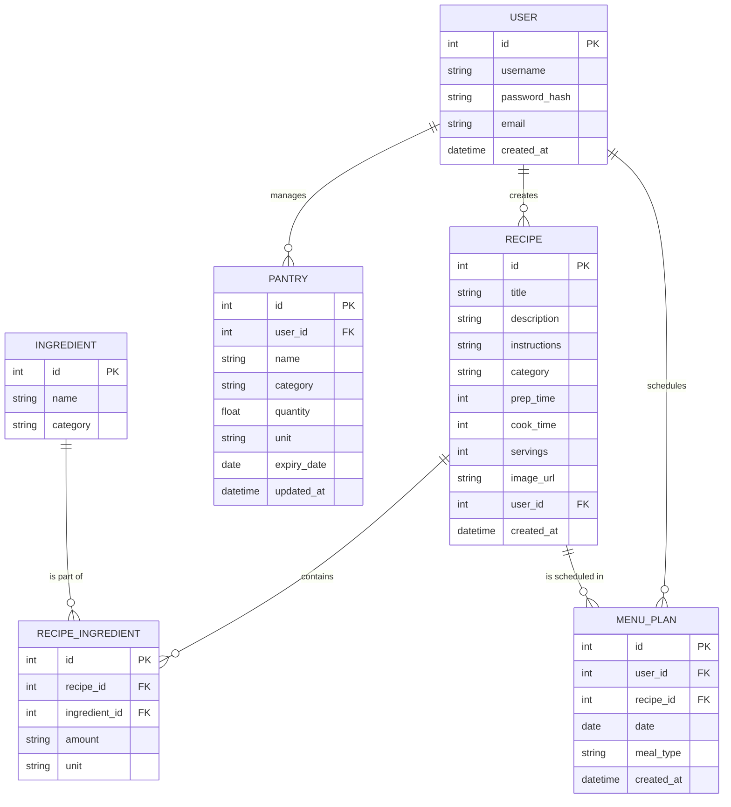

# 智慧烹飪菜單系統 - 資料庫設計文件 (DB Design)

## 1. ER 圖 (Entity-Relationship Diagram)

---

## 2. 資料表詳細說明

### USER (使用者)
| 欄位名 | 型別 | 說明 | 必填 | 備註 |
| :--- | :--- | :--- | :--- | :--- |
| id | INTEGER | 流水號 | 是 | Primary Key |
| username | TEXT | 帳號名稱 | 是 | Unique |
| password_hash | TEXT | 加密後的密碼 | 是 | |
| email | TEXT | 電子郵件 | 是 | Unique |
| created_at | DATETIME | 建立時間 | 是 | 預設為目前時間 |

### RECIPE (食譜)
| 欄位名 | 型別 | 說明 | 必填 | 備註 |
| :--- | :--- | :--- | :--- | :--- |
| id | INTEGER | 流水號 | 是 | Primary Key |
| title | TEXT | 食譜標題 | 是 | |
| description | TEXT | 簡介 | 否 | |
| instructions | TEXT | 料理步驟 (Markdown 格式) | 是 | |
| category | TEXT | 分類 (主食、甜點等) | 否 | |
| prep_time | INTEGER | 準備時間 (分鐘) | 否 | |
| cook_time | INTEGER | 烹飪時間 (分鐘) | 否 | |
| servings | INTEGER | 份量 (人份) | 否 | |
| image_url | TEXT | 圖片路徑 | 否 | |
| user_id | INTEGER | 建立者 ID | 是 | Foreign Key (USER.id) |
| created_at | DATETIME | 建立時間 | 是 | |

### INGREDIENT (食材 Master Table)
| 欄位名 | 型別 | 說明 | 必填 | 備註 |
| :--- | :--- | :--- | :--- | :--- |
| id | INTEGER | 流水號 | 是 | Primary Key |
| name | TEXT | 食材名稱 (如：番茄) | 是 | Unique |
| category | TEXT | 食材類別 (蔬菜、肉類等) | 否 | |

### RECIPE_INGREDIENT (食譜內容物)
| 欄位名 | 型別 | 說明 | 必填 | 備註 |
| :--- | :--- | :--- | :--- | :--- |
| id | INTEGER | 流水號 | 是 | Primary Key |
| recipe_id | INTEGER | 對應食譜 ID | 是 | Foreign Key (RECIPE.id) |
| ingredient_id | INTEGER | 對應食材 ID | 是 | Foreign Key (INGREDIENT.id) |
| amount | TEXT | 數量 (如：2) | 是 | |
| unit | TEXT | 單位 (如：顆) | 是 | |

### PANTRY (個人食材庫存)
| 欄位名 | 型別 | 說明 | 必填 | 備註 |
| :--- | :--- | :--- | :--- | :--- |
| id | INTEGER | 流水號 | 是 | Primary Key |
| user_id | INTEGER | 擁有者 ID | 是 | Foreign Key (USER.id) |
| name | TEXT | 食材名稱 (對應 Master) | 是 | |
| category | TEXT | 食材類別 | 否 | |
| quantity | REAL | 剩餘數量 | 是 | |
| unit | TEXT | 單位 | 是 | |
| expiry_date | DATE | 保存期限 | 否 | |
| updated_at | DATETIME | 最後更新時間 | 是 | |

### MENU_PLAN (菜單規劃)
| 欄位名 | 型別 | 說明 | 必填 | 備註 |
| :--- | :--- | :--- | :--- | :--- |
| id | INTEGER | 流水號 | 是 | Primary Key |
| user_id | INTEGER | 使用者 ID | 是 | Foreign Key (USER.id) |
| recipe_id | INTEGER | 食譜 ID | 是 | Foreign Key (RECIPE.id) |
| date | DATE | 預定日期 | 是 | |
| meal_type | TEXT | 餐次 (Breakfast/Lunch/Dinner) | 是 | |
| created_at | DATETIME | 紀錄建立時間 | 是 | |

---

## 3. SQL 建表語法

請見 [database/schema.sql](file:///c:/Users/caspe/t/web_app_development/database/schema.sql)。
