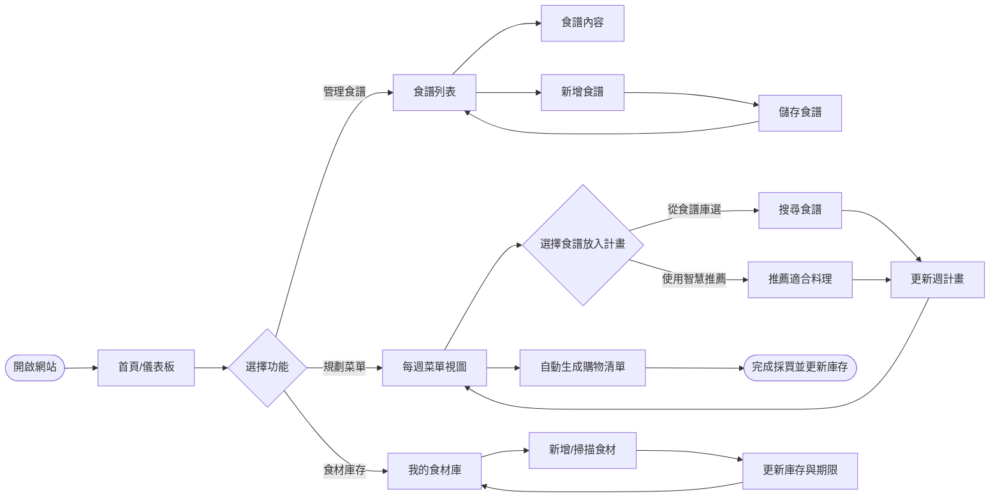
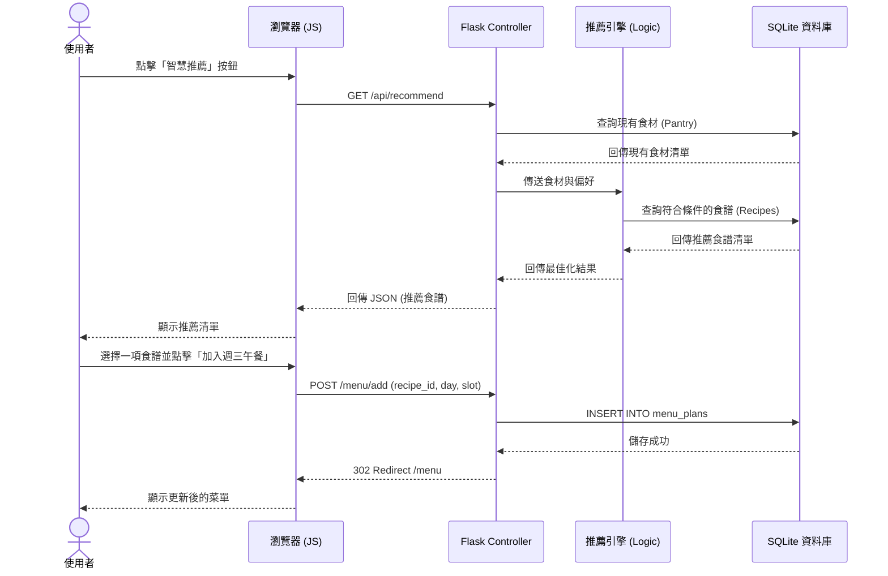

# 智慧烹飪菜單系統 - 流程設計文件 (Flowchart)

## 1. 使用者流程圖 (User Flow)

此流程圖展示了使用者在網站上的主要操作路徑：

---

## 2. 系統序列圖 (Sequence Diagram)

以下以「**使用智慧推薦功能並將食譜加入菜單**」為例，說明資料在系統各層級間的流動：

---

## 3. 功能清單與路由對照表

本系統的主要路由設計如下：

| 功能模組 | URL 路徑 | 方法 | 說明 |
| :--- | :--- | :--- | :--- |
| **首頁** | `/` | GET | 顯示儀表板、今日菜單摘要 |
| **食譜庫** | `/recipes` | GET | 瀏覽所有食譜 |
| **食譜管理** | `/recipes/new` | GET/POST | 新增食譜頁面與儲存動作 |
| **食譜詳情** | `/recipes/<int:id>` | GET | 查看特定食譜步驟與食材 |
| **菜單計畫** | `/menu` | GET | 顯示每週菜單規劃表 (日曆視圖) |
| **加入菜單** | `/menu/add` | POST | 將特定食譜排入某天的某餐次 |
| **食材庫存** | `/pantry` | GET | 管理家中的食材與保存期限 |
| **食材更新** | `/pantry/update` | POST | 批量更新庫存數量或新增食材 |
| **推薦 API** | `/api/recommend` | GET | 根據庫存回傳推薦食譜 (JSON) |
| **購物清單** | `/shopping-list` | GET | 根據菜單與庫存差額生成清單 |

---

## 4. 流程設計決策說明

1.  **推薦引擎的前端非同步化**：為了讓使用者在規劃菜單時能快速獲得靈感，推薦功能的觸發與呈現採用非同步請求 (AJAX)，避免整頁重新整理。
2.  **購物清單的動態計算**：購物清單不儲存實體資料，而是每次存取時根據「菜單所需食材」減去「目前庫存食材」動態計算。這能確保清單永遠反映最新現況。
3.  **單向的操作流向**：食譜的新增與管理作為獨立模組，為菜單規劃提供「素材」。而食材庫存則是「約束條件」，影響推薦結果。
